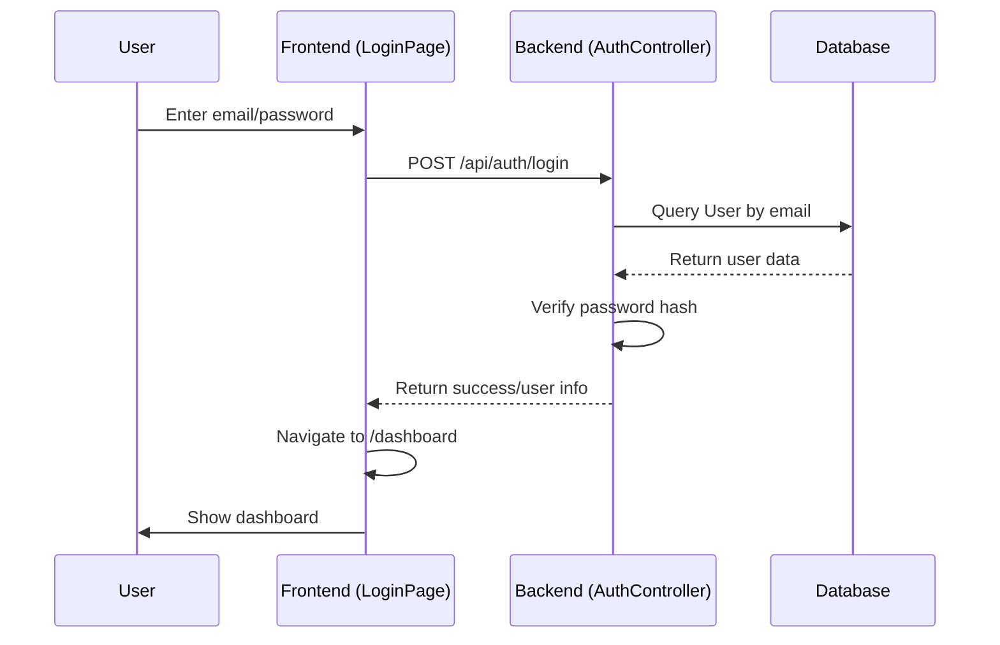
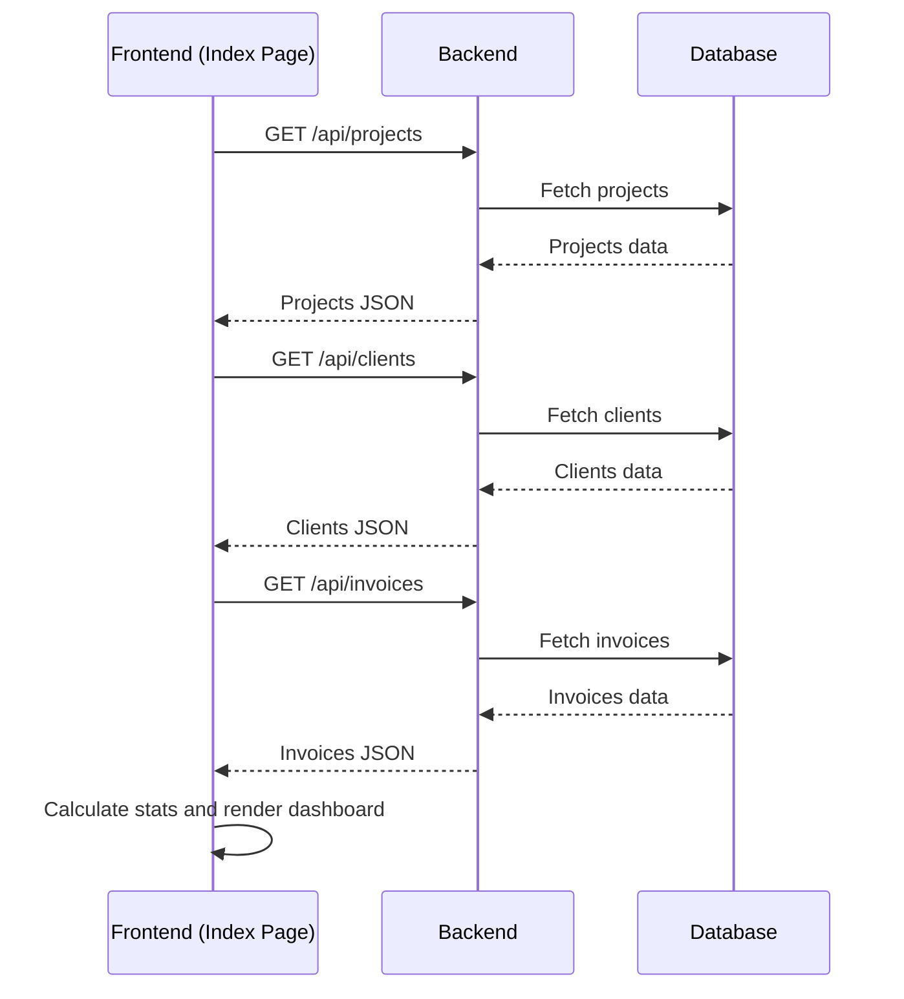
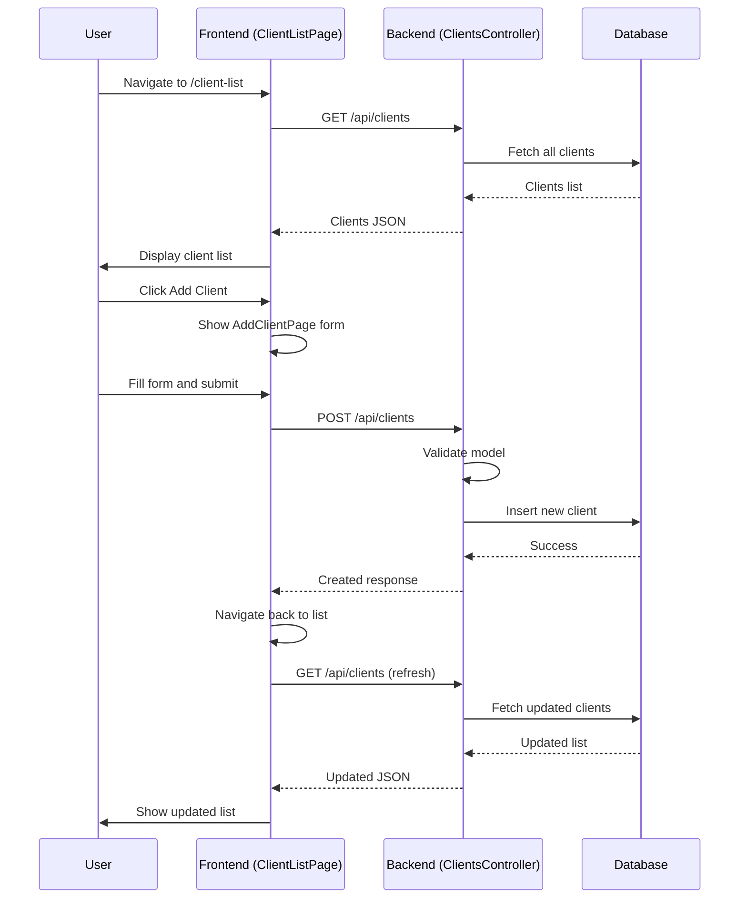

# Code Flow Diagram

This document outlines the high-level code flow and architecture of the YoursoftdigitalCRM application.

## Architecture Overview

```mermaid
graph TB
    A[User] --> B[Frontend (React/TypeScript)]
    B --> C[Backend API (ASP.NET Core)]
    C --> D[Database (SQLite)]
    B --> E[Browser Router]
    E --> F[Pages: Login, Dashboard, Clients, etc.]
    C --> G[Controllers: Auth, Clients, Projects, etc.]
    G --> H[Services]
    G --> I[Models]
    I --> J[Entity Framework DbContext]
    J --> D
```

## Login Flow Sequence Diagram



## Dashboard Data Fetching Flow



## Client Management Flow



## Key Components

- **Frontend**: Built with React, TypeScript, Vite, Tailwind CSS
- **Backend**: ASP.NET Core Web API with Entity Framework Core
- **Database**: SQLite for development
- **Authentication**: Custom implementation with password hashing
- **Routing**: React Router for frontend navigation
- **State Management**: React Query for API state
- **UI Components**: Shadcn/ui components

## Data Models

- User: Authentication and user management
- Client: Customer information
- Project: Project tracking
- Invoice: Billing and payments
- Task: Kanban tasks
- And more...

This diagram provides a high-level view of the application's code flow. For detailed implementation, refer to the source code in the respective directories.